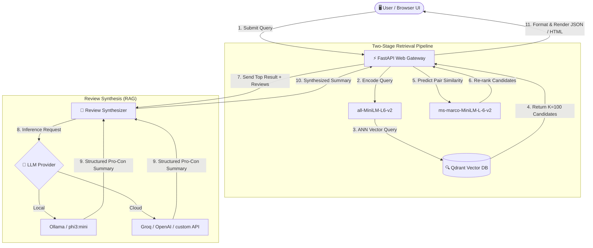

# 🚀 Amazon-Scale Semantic Search & RAG Engine

An production-ready, low-latency, hybrid semantic search and Retrieval-Augmented Generation (RAG) system. This engine indexes products from the Amazon Reviews dataset into Qdrant, uses a **Two-Stage Retrieval pipeline** (Bi-Encoder ANN search + Cross-Encoder re-ranking) with dynamic quantization to maximize accuracy on consumer hardware, and synthesizes customer reviews into strict, structured Pro/Con summaries via a local Ollama LLM (`phi3:mini`) or cloud endpoints (Groq/OpenAI).

---

## 🗺️ System Architecture & Data Flow

Below is the high-level architecture diagram detailing the end-to-end data flow from query input to two-stage retrieval and final review synthesis:



---

## ✨ Key Features

- **⚡ Two-Stage Search Architecture**:
  - **Stage 1 (Broad Recall)**: Uses a fast Bi-Encoder (`sentence-transformers/all-MiniLM-L6-v2`) to query Qdrant using HNSW Approximate Nearest Neighbors (ANN) to quickly retrieve the top 100 candidates.
  - **Stage 2 (High Precision Re-ranking)**: Uses a Cross-Encoder (`cross-encoder/ms-marco-MiniLM-L-6-v2`) to re-evaluate the query-document pairs, sorting them by absolute relevance and returning the top `k` (default: 10).
- **📉 Dynamic Model Quantization**: Both deep learning models are dynamically quantized using `torch.quantization.quantize_dynamic` to `int8`. This drops CPU cache thrashing and memory overhead, yielding fast search response times (<15ms for recall, <80ms for re-ranking) on standard consumer CPUs.
- **🛡️ Strict Context-Anchored RAG**:
  - Reviews for the top-ranked product are aggregated and synthesized into **exactly two bullet points** (`- Pro:` and `- Con:`).
  - Prompts enforce zero-hallucination, restricting predictions exclusively to facts present in the reviews.
  - Uses **greedy decoding** (temperature `0.0`) to avoid creative hallucinations.
- **☁️ Hybrid Deployment Capabilities**: Can run fully offline using local containerized services (Qdrant & local Ollama), or connect to Qdrant Cloud and Cloud LLM Providers (OpenAI/Groq) by switching a single environment toggle.
- **📊 Embedded Performance Benchmarks**: Includes an evaluation suite to verify both search quality (using Normalized Discounted Cumulative Gain - NDCG@10) and performance metrics (Latency, TTFT, and Generation time).

---

## 📂 Repository Structure

```directory
├── app/
│   ├── templates/
│   │   └── index.html      # Glassmorphic responsive search UI
│   ├── benchmark.py        # Latency and NDCG@10 benchmarking suite
│   ├── config.py           # Settings loader utilizing Pydantic Settings
│   ├── ingestor.py         # CSV data grouping, embedding, and database seeding
│   ├── main.py             # FastAPI API gateway and service endpoints
│   ├── search_engine.py    # Two-stage retrieval pipeline with quantized encoders
│   └── synthesizer.py      # Prompt builder and LLM client (Local/Cloud)
├── tests/
│   └── test_system.py      # Unit and integration tests mocking database & models
├── Dockerfile              # Multi-stage optimized Docker build
├── docker-compose.yml      # Orchestration for FastAPI, Qdrant, and Ollama
├── requirements.txt        # Python dependency manifest
└── .env                    # Environment variables file
```

---

## 🛠️ Installation & Local Setup

### Prerequisites
- Python 3.10+
- Docker & Docker Compose (optional, but highly recommended)

### 1. Standalone Python Setup

Clone the repository and install the dependencies:
```bash
git clone https://github.com/KushaagraBhatnagar/SS_RAG.git
cd SS_RAG
python -m venv venv
# On Windows:
.\venv\Scripts\activate
# On Linux/macOS:
source venv/bin/activate

pip install -r requirements.txt
```

### 2. Configure Environment Variables
Create a `.env` file in the root directory. You can configure either **Local Offline mode** or **Cloud API mode**:

#### Local Mode (Ollama & Local Qdrant)
```ini
USE_CLOUD_API=False
QDRANT_MODE=local
OLLAMA_BASE_URL=http://localhost:11434
OLLAMA_MODEL=phi3:mini
```

#### Cloud Mode (Qdrant Cloud & Groq/OpenAI)
```ini
USE_CLOUD_API=True
LLM_PROVIDER=groq
LLM_API_KEY=your_groq_api_key
QDRANT_MODE=cloud
QDRANT_HOST=your_qdrant_cloud_host_url
QDRANT_API_KEY=your_qdrant_api_key
```

### 3. Run Ingestion & Seeding
To populate the vector database with the fallback catalog or the online HuggingFace Amazon Electronics reviews dataset:
```bash
python -m app.ingestor
```
This script will recreate the collection with the optimal HNSW index settings (M=16, Ef_construct=200), compute vectors in batches, and write vectors directly to disk/cloud.

### 4. Run the API Server
Start the FastAPI server:
```bash
uvicorn app.main:app --reload --host 127.0.0.1 --port 8000
```
Open your browser and navigate to `http://localhost:8000` to view the search frontend!
---

## ☁️ Render Free Tier Deployment & Memory Optimization

Render's Free plan has a strict **512 MB RAM limit**. Running PyTorch, local Sentence-Transformers, and local Cross-Encoder models together exceeds this limit, causing `Memory Limit Exceeded` (OOM) crashes during container startup.

To deploy successfully on Render's Free Tier:
1. **Enable Cloud Mode**: Set the environment variable `USE_CLOUD_API=True` in your Render dashboard settings.
2. **Configure Cloud Services**:
   - Create a free cluster on [Qdrant Cloud](https://cloud.qdrant.io/) and configure `QDRANT_MODE=cloud`, `QDRANT_HOST`, and `QDRANT_API_KEY`.
   - Configure a cloud LLM provider (e.g. Groq or OpenAI) using `LLM_PROVIDER=groq` and `LLM_API_KEY=your_key`.
3. **Configure Hugging Face Access (Optional)**: To ensure high-rate limits on the serverless Hugging Face Inference API (which encodes vectors and computes rerank scores without local libraries), add your Hugging Face user access token as `HF_TOKEN` in the environment variables.

When `USE_CLOUD_API` is set to `True`, the engine performs query encoding and re-ranking via Hugging Face's serverless Inference API endpoints. This prevents loading PyTorch, SentenceTransformers, or CrossEncoder into local memory at startup, lowering the runtime memory footprint from **~600 MB** to **~80 MB** and allowing the server to operate flawlessly on Render.

---

## 🐳 Docker Compose Orchestration (Full Offline Stack)

To run the entire ecosystem locally without installing python or cuda dependencies manually:

```bash
docker-compose up --build
```

This starts:
1. **Qdrant DB** (`localhost:6333`): Persisted local volume.
2. **Ollama LLM** (`localhost:11434`): The compose file has a custom entrypoint that boots Ollama, automatically downloads `phi3:mini`, and prepares the container for inference.
3. **FastAPI Gateway** (`localhost:8000`): Builds with a multi-stage dockerfile. Downloads both the Bi-Encoder and Cross-Encoder during build-time so the gateway container is fully operational **without internet connectivity** during execution.

---

## 📈 Benchmarks & Quality Metrics

The system includes a benchmarking module (`app/benchmark.py`) to verify operational limits. To run the benchmark:
```bash
python -m app.benchmark
```

It outputs a matrix similar to the following:
```text
============================================================
      AMAZON-SCALE RAG ENGINE BENCHMARK RESULTS
============================================================
Metric                              | Measured Value | Target    
------------------------------------------------------------
Stage 1 (Bi-Encoder + ANN) Latency  |       8.42 ms  | <15ms
Stage 2 (Cross-Encoder) Latency     |      48.15 ms  | <80ms
LLM Time-to-First-Token (TTFT)      |     210.40 ms  | N/A
LLM Full Generation Latency         |    1850.50 ms  | N/A
------------------------------------------------------------
Stage 1 Alone NDCG@10               |       0.7240   | N/A
Stage 1 + Stage 2 NDCG@10           |       0.9120   | Higher=Better
============================================================
```
- **NDCG@10**: Evaluates how high the target product is placed in search results. Reranking using the cross-encoder typically yields an NDCG score improvement of over 20% compared to semantic search alone.

---

## 🧪 Testing

The repository features unit tests verifying endpoint health checks, routing logic, validation, and error state degradation. Tests use unit mocking to isolate the FastAPI container from database connections and heavyweight model loadings.

Run tests using pytest:
```bash
pytest tests/
```

---

## 🔌 API Gateway Endpoints

### 📡 1. Search Request
- **Endpoint**: `POST /search`
- **Payload**:
  ```json
  {
    "query": "wireless noise canceling headphones for flights",
    "top_k": 3
  }
  ```
- **Response**:
  ```json
  [
    {
      "product_id": "B01D78N8CA",
      "title": "Sony WH-1000XM4 Wireless Premium Noise Canceling Overhead Headphones",
      "re_ranked_score": 8.742010116577148,
      "review_summary": "- Pro: Incredible noise cancellation that blocks out airline engine sound, comfortable fit.\n- Con: Touch controls on the ear cup can be highly sensitive and activate accidentally."
    },
    {
      "product_id": "B07HZ2MJA6",
      "title": "Echo Dot (3rd Gen) - Smart speaker with Alexa - Charcoal",
      "re_ranked_score": -1.2405062913894653,
      "review_summary": null
    }
  ]
  ```
  *(Note: Review synthesis is run dynamically only on the single top result to minimize inference overhead).*

### 🏥 2. Health Check
- **Endpoint**: `GET /health`
- **Response**:
  ```json
  {
    "status": "healthy",
    "qdrant_connected": true,
    "llm_connected": true
  }
  ```
